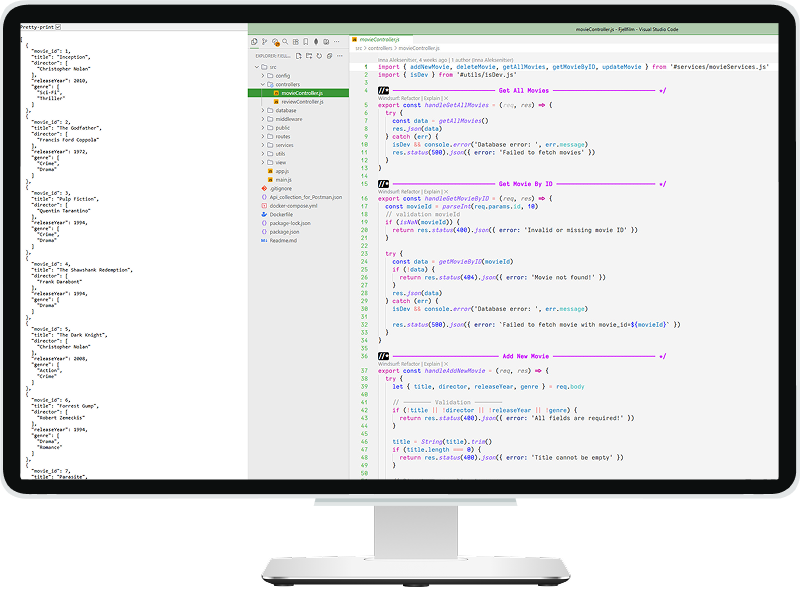

# Project name: 🎬 FjellFilm

### Project Goal:

Velkommen til din første dag som backend-utvikler i (det fiktive) filmselskapet Fjellfilm. Du har fått et viktig oppdrag: Lag et Movie Review API slik at både filmelskere og kritikere kan finne, dele og oppdatere filmanmeldelser.

Mål:

- Sett opp et nytt Node.js + Express-prosjekt
- Lag en database som inneholder to tabeller: Movies og Reviews.  
  Bruk relevante datatyper for kolonnene, og sørg for å koble Reviews opp mot Movies. (Relasjonsbygging)
- Lag CRUD-endepunkter (Create, Read, Update, Delete)
- Lag en README.md som beskriver API-et med eksempler

> [!IMPORTANT]  
> Viktig: Implementer validering og bruk riktige statuskoder.

## **About**

[](preview.png)

A simple RESTful API for managing movies and reviews, built with **Express.js** and **SQLite** (Better-SQLite3).  
The project supports basic **CRUD** operations for movies and nested CRUD for movie reviews.

### 🧩 Tech Stack


<details style="border:1px solid #d4d4d4; border-radius:2px; padding:1rem;">
<summary><h4 style="display:inline; padding-left:6px;">📦 Dependencies:</h4></summary>

```bash
npm install express
npm install nodemon -D
npm install nodemon -g
npm install cors
npm install dotenv
npm install better-sqlite3
npm install express-rate-limit
npm install helmet
```

</details>

### ✨ Features

- Full CRUD operations for movies and reviews
- Foreign key constraints with cascading delete
- For just created DB automatically seeding of initial data
- Input validation and error handling
- Rate limiting and security headers
- Config-based environment control (`NODE_ENV`, `.env`)

### 👩‍💻 Author

**FjellFilm API** – created for a course project.  
Clean code, pragmatic architecture, and a tiny sprinkle of Scandinavian drama.

<details>
<summary><h3 style="display:inline" >⚙️ Installation & Setup</h3></summary>

```js
// Install dependencies
npm install

// Start the server
npm run dev
```

- **The server runs on:** `http://localhost:4200`
- **Database:** Each time the server starts, `database.js` checks if the tables exist.

  - If the tables were just created (i.e., the database is new), `seed.js` is automatically run to populate initial data.

---

</details>

<details>
<summary><h3 style="display:inline" >🚀 Deployment</h3></summary>

The project is deployed on **Render** using a custom **Dockerfile**.

- **Live API**: https://fjellfilm.onrender.com/api/movies

Render automatically builds and runs the app using the `Dockerfile` provided in the repository.
The image is based on a lightweight Node.js environment (`node:20-alpine`) and runs the server via:

`CMD ["node", "src/main.js"]`

No manual configuration is required — the container starts the Express server automatically when deployed.
If the database is created for the first time, it will be automatically seeded with initial data using `seed.js`.

**Example usage:**

**GET** `https://fjellfilm.onrender.com/api/movies`  
returns a list of all movies stored in the database.

---

</details>
<details>
<summary><h3 style="display:inline" >🗃️ API Endpoints</h3></summary>

### 👉 [Api_collection_for_Postman](Api_collection_for_Postman.json)

### 🎥 Movies

| **Method** | **Endpoint**    | **Description**              |
| ---------- | --------------- | ---------------------------- |
| GET        | /api/movies     | Fetch all movies             |
| GET        | /api/movies/:id | Fetch a specific movie by ID |
| POST       | /api/movies     | Add a new movie              |
| PUT        | /api/movies/:id | Update an existing movie     |
| DELETE     | /api/movies/:id | Delete a movie by ID         |

#### **Examples**

- Create movie: **POST** `http://localhost:4200/api/movies`

```json
{
	"title": "No Mercy",
	"director": "Richard Pearce",
	"releaseYear": 1985,
	"genre": ["Drama", "Action"]
}
```

- Read all movies data: **GET** `http://localhost:4200/api/movies`
- Read single movie data: **GET** `http://localhost:4200/api/movies/6`

- Update movie: **PUT** `http://localhost:4200/api/movies/11`

```json
{
	"title": "No Mercy",
	"director": "Richard Pearce",
	"releaseYear": 1986,
	"genre": ["Drama", "Action", "Thriller"]
}
```

- Delete movie: **DELETE** `http://localhost:4200/api/movies/11`  
  ( including cascading deletion of reviews related to a movie )

### 📝 Reviews

| Method | Endpoint                          | Description                          |
| ------ | --------------------------------- | ------------------------------------ |
| GET    | /api/movies/:id/reviews           | Get all reviews for a specific movie |
| POST   | /api/movies/:id/reviews           | Add a review for a specific movie    |
| DELETE | /api/movies/:id/reviews/:reviewId | Delete a review by ID                |

#### **Examples**

- Create review: **POST** `http://localhost:4200/api/movies/11/reviews`

```json
{
	"name": "Avata",
	"message": "Could not care any less about this movie if I tried. Horrible, boring, and a complete waste of time.",
	"rating": 2
}
```

```json
{
	"name": "John",
	"message": " I've seen worse, but this isn't a good movie. Basinger's hotness is the only highlight.",
	"rating": 3
}
```

- Read reviews: **GET** `http://localhost:4200/api/movies/11/reviews`

- Delete review: **DELETE** `DELETE http://localhost:4200/api/movies/11/reviews/25`

---

</details>
